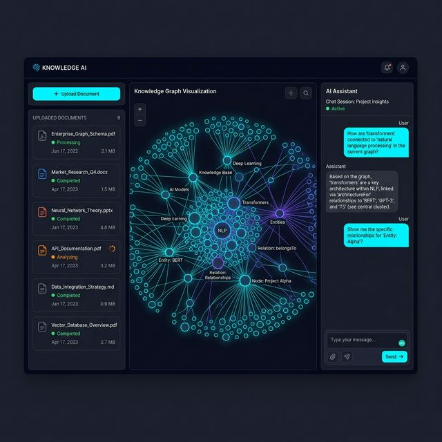

# VeinGraph (脉络)

[](https://adoptium.net/)
[](https://spring.io/projects/spring-boot)
[](https://neo4j.com)
[](https://www.elastic.co/)
[](https://www.mongodb.com/)
[](https://open.bigmodel.cn/)
[](https://vuejs.org/)

**VeinGraph (脉络)** 是一个赛博暗黑风格的企业级 RAG (Retrieval-Augmented Generation) 知识图谱构建与问答系统。
本项目基于 **Spring AI** 接入强大的大语言模型，并结合 **Vue 3** + **vis-network** 实现高度动效渲染的文档图谱分析面板。

它能吞吐海量的结构/非结构化文档，通过多模态数据架构自动提纯实体与关系网络，打破 AI 幻觉，提供精确制导的流式认知问答。

 
*(此为系统视觉与交互草图)*

---

## 🚀 核心架构与黑科技

*   **「多路并发」图谱召回 (GraphRAG)**
    当用户发起提问时，底层问答引擎将并发拉起三路通道：(1) **Text2Cypher** 到 Neo4j 绘制图谱上下文 (2) **Elasticsearch** 混合向量检索 (Hybrid Search) 定位原始引用 (3) **Redis** 热缓提取会话记忆。最终以光速拼装为超级 Prompt 投递大模型，彻底消灭 AI 虚假捏造。
*   **出件箱发件与 Kafka 柔性流水线**
    支持兆字节文档的并行切块。数据主线经由 MongoDB 落地，再通过 Spring 定时器挂载 Outbox 模式，依靠 Kafka 将沉重的实体提取（Entity Extraction）、向量化（Embedding）以及 Neo4j 节点 MERGE 彻底异步剥离，服务主线程如丝般顺滑。
*   **内置智能防呆引擎 (Entity Resolution)**
    后端自动基于 Levenshtein 编辑距离聚类 + LLM 二次判定，将漫天横飞的「同名」「代词」等脏实体进行批量合并，保障图谱极致整洁。
*   **全沉浸式极客 UI**
    绝不妥协的前端设计。基于深邃科幻的 CSS 黑金质感滤镜，搭配 vis-network 动态物理引擎，让每一篇文档都拥有生命般呼吸的立体展示。

---

## 🛠️ 5 分钟光速启动体验

> **前置要求**: 本机需装有 Docker Compose, JDK 17, Node.js 以及一个智谱 AI (GLM) 的 API Key。

### 1. 唤醒深渊基建（一键起步）

我们已在内部集成全套底层数据库容器。一键拉起 Redis, MongoDB, Neo4j, Elasticsearch, 和 Kafka 联邦：

```bash
cd docker
docker compose up -d
```
> *(稍等几分钟等待镜像初次拉取完毕并激活)*

### 2. 注入灵魂 (API Key)

将本仓库提供的 `.env.example` 复制一份并改名为 `.env`。
填入你的智谱开发者密钥：
```env
ZHIPUAI_API_KEY=换成你从官网获取的Key
```

### 3. 点燃后端引擎

退回项目根目录，通过 Maven 起飞：
```bash
mvn clean compile
mvn spring-boot:run
```
*(后端引擎将在 `localhost:9999` 启动并时刻监听请求。)*

### 4. 接入可视终端 (Web UI)

```bash
cd web
npm install
npm run dev
```
立即用浏览器访问 `http://localhost:5173`。上传你的第一篇复杂分析报告，静看漫天节点如同脉络一般生长。

---

## 📜 协议 (License)

本项目基于 **Apache-2.0** 许可证开源。请尽情魔改、分发并用来创造更酷的世界。

---

## 🔄 LLM 引擎热切换指南 (兼容 OpenAI / Ollama)

VeinGraph 的一大优势是底层完全基于 **Spring AI 统一架构** 开发，这意味着系统核心的图谱抽取和问答引擎与具体的模型厂商**100% 解耦**。如果你没有智谱 AI 的令牌，或者想换上 OpenAI、DeepSeek、甚至是本地的 Ollama（离线隐私部署），只需极简的两步即可完成换脑：

### 示例：切换为 OpenAI / 第三方兼容模型 (如 DeepSeek)
**1. 修改 Maven 依赖 (`pom.xml`)**
将智谱 AI 的 starter 移除：
```xml
<!-- <dependency>
    <groupId>com.alibaba.cloud.ai</groupId>
    <artifactId>spring-ai-alibaba-starter-model-zhipuai</artifactId>
</dependency> -->

<!-- 替换为 -->
<dependency>
    <groupId>org.springframework.ai</groupId>
    <artifactId>spring-ai-openai-spring-boot-starter</artifactId>
</dependency>
```

**2. 修改配置文件 (`application.yml`)**
将 `spring.ai.zhipuai.*` 节点替换为 OpenAI 节点：
```yaml
spring:
  ai:
    openai:
      api-key: ${OPENAI_API_KEY}
      base-url: "https://api.openai.com/v1" # 或者填入 DeepSeek 等兼容 OpenAI API 的网址
      chat:
        options:
          model: gpt-4o # 或者 deepseek-chat
```
无需更改任何一行 Java 代码，重启即可生效！

### 示例：完全离线化部署 (切换为 Ollama)
如果你的涉密文档不允许出网，可以在本地启动 Ollama 运行 `qwen:32b` 或 `llama3`。方法同理，引入 `spring-ai-ollama-spring-boot-starter` 并指定本地 `127.0.0.1:11434` 端点即可。

---

> *"The data is the new oil, but the relationships are the new combustion engine."* —— VeinGraph Team