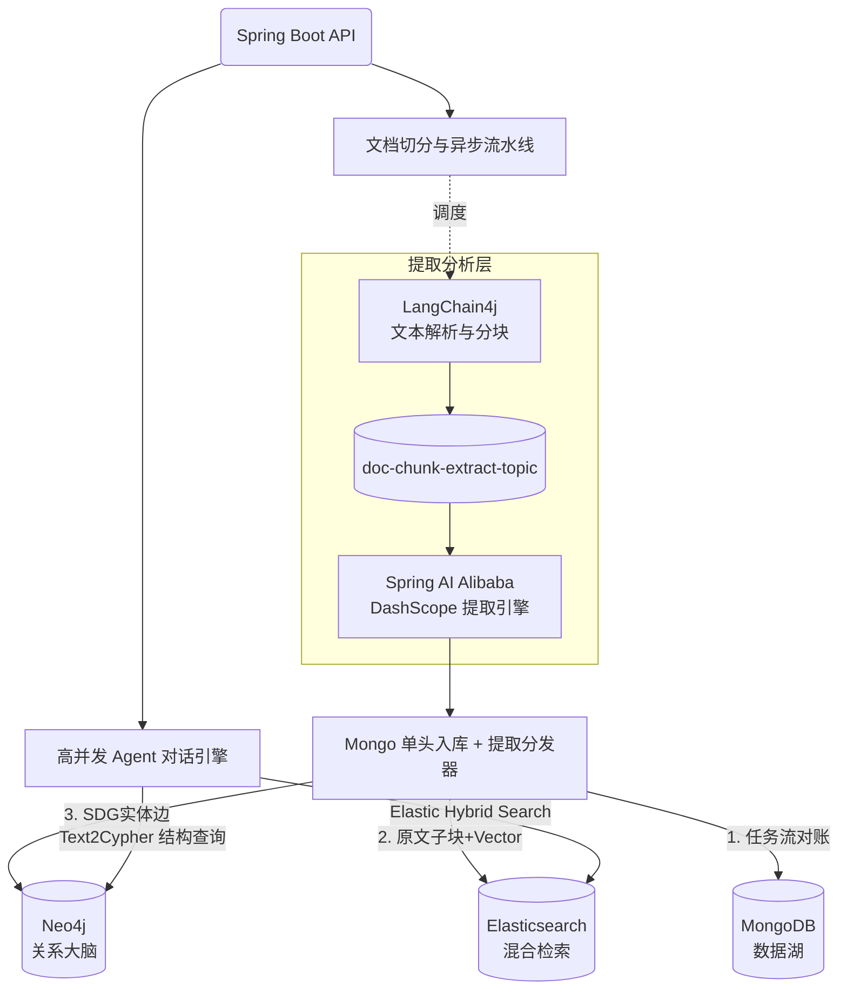

# 脉络 (VeinGraph) 

[](https://adoptium.net/)
[](https://spring.io/projects/spring-boot)
[](https://neo4j.com)
[](https://www.elastic.co/)
[](https://www.mongodb.com/)
[-orange.svg)](https://dashscope.aliyun.com/)

**VeinGraph** 是一个基于大语言模型（LLM）的自动化企业级实体关系抽提与问答级数图谱构建系统。它专注于从海量的长篇幅、非结构化文本中精准剥离出有价值的关系网络，并提供抗幻觉的知识问答能力（GraphRAG）。

## 🚀 核心特性

- **高度分工的 LLM 处理流**：
  - 采用 **LangChain4j** 纯本地模式进行高强度文档解构（PDF/Word识别）与令牌感知切块（Recursive Splitter）。
  - 采用 **Spring AI Alibaba** 接管核心的大模型交互环节，通过严谨的 Function Calling 机制保障结构化信息输出，极大降低模型生成错乱概率。
- **发件箱驱动的三模态数据架构**：抛弃繁重的 Saga 分布式事务，业务主写通过 MongoDB，辅以 Change Streams 及 Kafka 异步投递分发，巧妙实现异构数据最终一致性。
  1. **MongoDB (真理数据湖)**：保留原文、切块与全链路日志；兼并作为系统账户与任务流水的主业务库。
  2. **Neo4j 5 (关系大脑)**：通过 Spring Data Neo4j (SDN) 绘制出复杂实体关联结构图。
  3. **Elasticsearch 8 (语义/防幻觉引擎)**：构建稠密向量与反向索引字典，提供混合检索（Hybrid Search）。
- **极速的双轨并发式对话 Agent**：在检索增强环节（GraphRAG），采用 Java 21 *（或向下兼容 17 的并发池）* 并行发起 Text2Cypher（Neo4j 查证据）与 向量匹配（ES 查原文）。最终熔合并拼装成一个超级 Context 给 LLM 一次性解答。首字段响应极快，且彻底拔除回答幻觉。

---

## 🏗️ 架构概览



---

## 🛠️ 快速启动指南

### 环境前置要求

- JDK 17 及以上
- Docker 与 Docker Compose
- Maven 3.8+
- 阿里云百炼 API 令牌 (DashScope API Key)

### 第一步：启动异构存储栈中间件

项目根目录 `docker/docker-compose.yml` 已配置好全链路基础设施集群。依次包含了 `Redis`, `MongoDB`, `Neo4j`, `Elasticsearch`, `Kafka/Zookeeper`：

```bash
cd docker
# 一键起步所有依赖引擎，初始下载可能需要几分钟
docker compose up -d
```
> **默认密码说明**（见配置文件）：
> Neo4j默认Web端: `http://localhost:7474` (neo4j / veingraph)
> Elasticsearch: `http://localhost:9200`
> MongoDB: `localhost:27017` (root / veingraph)

### 第二步：配置大模型令牌

在执行项目前，请将您的通义千问 API 密钥写入环境变量：
```bash
# Windows (PowerShell)
$env:DASHSCOPE_API_KEY="sk-xxxxxxxxxxx"

# Linux / MacOS
export DASHSCOPE_API_KEY="sk-xxxxxxxxxxx"
```

### 第三步：编译与运行主服务

回到项目根录，触发 Maven 打包并运行 Spring Boot 服务器：

```bash
mvn clean package -DskipTests
java -jar target/veingraph-server-0.1.0-SNAPSHOT.jar
```

### 第四步：健康总检接口

服务默认在 `8080` 启动，可用浏览器或 Postman 访问统一探活与资源就绪检查端点（囊括五大数据源连通性测试）：
```
GET http://localhost:8080/api/health/datasources
```
返回 `✅ 连接正常` 表示所有链路已经就绪。

---

## 📅 近期开发路线

- [x] Phase 1: Spring Boot 基建、多数据源注册、Docker Compose 集成
- [ ] Phase 2: LangChain4j 文档分片、Spring AI Tool Calling 与 JSON Schema 限定实验
- [ ] Phase 3: Kafka 队列限流与异步抽取管道、MongoDB 落地兜底与分发逻辑
- [ ] Phase 4: Neo4j Cypher 注入与 Elasticsearch 8.x Embedding 混合关联
- [ ] Phase 5: 高级 GraphRAG 召回机制设计与前端 UI 对接