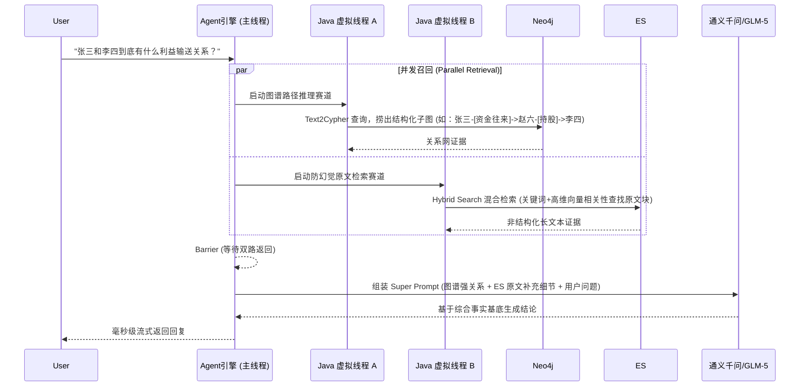

# 脉络 (VeinGraph) — 高级架构设计文档 (基于 LLM 的实体/关系提取与 Agent 对话系统)

## 1. 项目概述

**VeinGraph** 是一个旨在从海量非结构化文本中构建高价值知识图谱，并提供智能问答交互的企业级系统。不仅具备基础的提取和存储能力，更通过引入高级架构设计（GraphRAG，多模态存储策略，大模型容错）来保证系统在复杂业务场景下的高可用性和结果准确性。

---

## 2. 技术选型 (全面升级)

| 领域 | 技术栈 | 核心用途说明 |
|------|------|-------------|
| **后端框架** | Spring Boot 3.x + Java 17 | 核心业务调度与全流程控制 |
| **业务数据库 & 数据湖** | **MongoDB** | 存储结构化的业务数据（用户体系、权限、任务流水）以及原始长文、提取的底层运行日志。实现业务和数据的存储归一化 |
| **底层处理 (Document & Chunking)** | **LangChain4j** | **仅作为纯粹的本地 NLP 工具包使用**（专注于 Tika 文档解析与 `RecursiveCharacterTextSplitter` 切分），**不参与任何网络请求**，解决超长文本 Token 限制问题 |
| **LLM 调用层** | **Spring AI Alibaba** | 接管所有的 LLM 网络 IO 和状态管理。底层对接阿里云百炼（DashScope），不仅丝滑调用通义千问，还能极低成本切换对接阿里百炼生态内如 GLM-5 等其他顶尖模型。利用 `@ChatClient` 实现结构化抽取 |
| **异步解耦层** | **Kafka** | 提供 `doc-chunk-extract-topic`，前端上传长文切分成块后丢入，后端异步批量消费提取，防止接口超时拖垮主线程 |
| **数据湖 (Data Lake)** | **MongoDB** | (职责上方已包含: 数据湖及日志存放) |
| **关系大脑 (Knowledge Core)**| **Neo4j 5.x** | 存储实体 (Person) 和关联边 (Relationship)，基于 Spring Data Neo4j (SDN) 映射图对象并执行 Cypher 推理 |
| **语义与防幻觉引擎**| **Elasticsearch (>= 8.x)** | 存储文本块的原始文字和向量（Dense Vector），提供 **Hybrid Search**（关键词 + 向量相似度混合检索），对抗 LLM 幻觉 |
| **缓存** | Redis | Session 控制、LLM 临时上下文缓存、热点图谱数据缓存 |

---

## 3. 全局架构图

```mermaid
graph TB
    subgraph 用户交互层
        UI[Vue 3 前端] --> API_GW(Spring Boot API)
    end

    subgraph 核心应用层 [Spring Boot 3 + 虚拟线程架构]
        API_GW --> Agent[高并发 Agent 对话引擎<br>Parallel Retrieval]
        API_GW --> Upload[文件上传接入层]
        
        subgraph 大模型能力层
            LangChain4j[LangChain4j<br>底层: 文本解析与分块]
            SpringAI[Spring AI Alibaba<br>上层: 封装抽象与调用]
        end

        subgraph Kafka 异步解耦层
            Topic[(topic: doc-chunk-extract-topic)]
        end

        Upload --> LangChain4j
        LangChain4j -->|文本块切分 Chunk| Topic
        Topic -->|异步拉取消费| SpringAI
        
        SpringAI --> Res[实体消解与统一]
    end

    subgraph 数据持久化层
        Res --> Sync[多模态分发中间件]
        Sync -->|1. 原始原文/运行日志汇总| Mongo[(MongoDB<br>数据湖)]
        Sync -->|2. 原文结构化子块+向量| ES[(Elasticsearch 8.x<br>语义与防幻觉引擎)]
        Sync -->|3. SDG实体边映射| Neo4j[(Neo4j<br>关系大脑)]
        
        Agent -->|Text2Cypher 结构查询| Neo4j
        Agent -->|常规业务CRUD/历史归档| Mongo
        Agent -->|Hybrid Search(标量+向量)| ES
    end

    subgraph 基础大模型能力
        LLMExtract -.->|重试/降级封装| DashScope((阿里云通义千问 API))
        Agent -.-> DashScope
    end
```

---

## 4. 核心难点突破策略

### 4.1 指代消解与实体统一 (Entity Resolution)

在提取过程中，遇到的核心问题是同一实体在文中的不同表述（例如：“局长”、“他”、“张三”、“老张”）。我们采用 **结合 NLP Heuristics 与 LLM 推理的混合实体统一策略**：

1. **同义词典与正则合并 (基础层)**：
   - 构建业务字典，对于完全匹配的缩写或已知别名在入图前进行预处理。
2. **上下文指代消解 (Coreference Resolution - 提取阶段)**：
   - 在 Prompt 中明确要求 LLM 执行代词替换。让大模型在提取节点前，把“他”还原为最近的上下文主语。
3. **图谱合并与消歧 (Graph阶段)**：
    - 在入图谱之前，查询 Neo4j / ES 8.x 中的现有实体。
    - 如果遇到同名同姓，核心依据 **关系特征** 和 **Elasticsearch 中的 Dense Vector 上下文相似度**。提取上下文描述与已有实体的关联节点，通过 LLM 进行 `MatchScore` 计算来实现准确合并。
   - 确认是同一实体则执行 Cypher 的 `MERGE` 更新属性或关系；确认为不同实体，则创建新节点并在内部维护 `<实体名>_<唯一标识符>`。

### 4.2 大模型的不稳定性与容错设计

LLM 输出格式错乱（吐出非 JSON）或虚构人物关系是常见现象。后端 Java 层设计了强健的保障机制：

1. **结构化输出约束 (JSON Mode & Schema Validation)**：
   - Spring AI Alibaba 的 `@ChatClient` 与百炼平台通信时，强制开启 JSON 返回格式限制，通过框架层反序列化强类型对象（如 `ExtractionResult`）。如果模型返回不符合 Schema，直接在提取消费者层级抛出。
2. **重试与退避策略 (Retry Mechanism)**：
   - 使用 Spring Retry 框架，设置最大重试 3 次。配合 Exponential Backoff（指数退避）。
   - 第二次重试时，会在 Prompt 头部动态注入：`“之前的输出存在语法错误：{错误详情}，请严格按照以下 JSON Schema 输出”`。
3. **逻辑校验与虚无拦截 (Hallucination Fallback)**：
   - 必须通过**防幻觉兜底校验**：若抽取的人物在原始切块中无法正则或近似匹配，判定为虚构。
   - 熔断降级 (Circuit Breaker)：若消费端多次重试依旧失败，将该纯文本段及原始错误日志全量保存到 MongoDB 数据湖 `failed_extractions` 集合，标记 `status="NEEDS_HUMAN"`，丢入人工对账队列，绝不阻塞整个文档余下章节的抽取进度。

### 4.3 提示词工程 (Prompt Engineering) 设计

为了让通义千问等模型稳定输出结构化数据，使用 **Few-Shot (少样本)** 结合 **CoT (思维链)** 的组合拳：

```text
[System]
你是一个严谨的结构化知识抽取专家。你的任务是从文本中抽取实体及其关系。
核心规则：
1. 绝对不要捏造文本中未提及的人物或关系。
2. 先识别核心人物，再分析他们的行为产生什么关系。
3. 只允许输出合法的 JSON 数组，严禁包含任何如 "```json", "分析如下" 等多余文字。

[Few-Shot Example]
输入: "王局长昨天在会议室会见了李主任，两人讨论了经费事宜。"
输出:
[
  {"source": "王局长", "target": "李主任", "relation": "会见", "evidence": "王局长昨天在会议室会见了李主任"}
]

[User Input]
输入文本: {doc_chunk}
结构化输出:
```

---

### 4.4 GraphRAG：基于并发上下文召回的检索增强 (Parallel Retrieval)

当用户提问时，如果让大模型串行思考调用哪个工具，响应延迟 (RT) 会非常长。系统优化为 **并发召回 + 一次性融合生成**：



**性能与防御双核心**：
1. **耗时减半**：利用 Spring Boot 3 + Java 21 的 `Virtual Threads`，原本耗时串行的两次跨网络查询被压缩到单次最长等待时间内完成。
2. **深度防御**：即使图数据库的查询路径断裂或提取疏漏，Elasticsearch (>= 8.x) 通过 Dense Vector 找回的文章原文也能给大模型提供足够事实依据，强力消除大模型幻觉。

---

### 4.5 细化多模态数据持久化架构

本系统的数据持久层分工极为明确：

1. **MongoDB（数据湖与对账底表）**：
   - 扮演**最基础的真理库**。原始文档大文件通过 GridFS 存放；所有切分后的文本（带来源标识）、系统运行全链路日志、以及模型吐出的原始不可靠 JSON 尽数归档于此。后续人工审查、回溯重算，均以 Mongo 里的数据为基准。
2. **Elasticsearch >= 8.x（语义与防幻觉引擎）**：
   - 不仅存储倒排索引的纯文本字词。利用 ES 近期版本的强劲**稠密向量 (Dense Vector)** 特性，同步存储 LangChain4j 在分块阶段生成的 Text Embeddings。提供 **Hybrid Search (混合检索)** 能力，解决纯字面搜索“查不全”与单靠向量“查不准”的痛点。
3. **Neo4j（关系大脑）**：
   - 存储极致提纯的知识：实体 (Person 等强类型 Node) 和边 (关系)。采用 **Spring Data Neo4j (SDN)** 持久化映射到 Java 的 POJO 层，专注于在极大规模数据下提供毫秒级的连通性探索（最短路径、N度人脉计算）。

---

### 4.6 多源异构数据一致性保障策略 (发件箱模式 Outbox Pattern)

面临 MongoDB（原始长文/对账底表）、ES 8.x（混合检索）和 Neo4j（关系大脑）的同步更新，若采用传统的分布式 Saga 模式开发成本高且易出现网络脑裂/死锁。我们采用极致轻量的 **变更流与发件箱组合模式** 来保证数据的最终一致性：

1. **主干单写 (Write-Ahead)**：
   应用层提取出结构化关系 JSON 后，**只向 MongoDB 执行一条落库命令**，数据结构上附加同步状态字段 `status="UNSYNCED"`。此时对于业务即视为“提取成功”。
2. **变更流捕获底座 (Change Streams / Watcher)**：
   后端应用启动一组专门监听 MongoDB Change Streams 的虚拟线程（或作为一个微型定时流式扫描任务），敏锐捕获带有 `UNSYNCED` 标记的增量 Document。
3. **扇出同步补偿 (Fan-out Upsert)**：
   扫描器捕获到变更后，将其推入轻型线程池中进行平滑双刷：
   - 向 Elasticsearch 发送批量 `_bulk` 更新合并索引（包含提取结果和计算好的 Dense Vector）。
   - 向 Neo4j 发射合并语句 (`MERGE (n)-[r]->(m)`) 更新结构化网络。
   - 只有这两部分全部 `ACK` 成功后，将 MongoDB 中的状态更新为 `status="SYNCED"`。

> **架构收益**：完全摆脱复杂的分布式两阶段提交或重型 Saga。若 Neo4j/ES 网络抖动不可用，变更流任务只会不断按退避策略重试 `UNSYNCED` 数据，不会阻塞上游主业务数据写入。并且此基底自带全量异构数据的自愈对账能力。

---

## User Review Required

> [!IMPORTANT]
> 经过顶级优化洗礼后的架构文档，完全移除了冗余和隐患：
> - 职能干练：LangChain4j (本地文本) 与 Spring AI (远程IO调用/大模型接入)。
> - 极简一致性：放弃 Saga 枷锁，转投 MongoDB 变更流 (Change Streams) 的发件箱 (Outbox) 怀抱。
> - 极致并发：Agent 的检索链路升阶为高并发的虚拟线程召回 (Parallel Retrieval) 模式。
